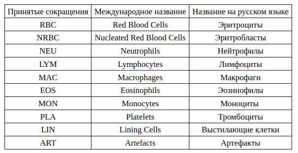
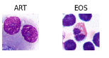
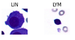
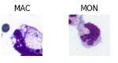
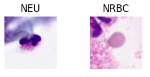
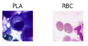

# Методы классификации объектов на изображении микроскопической пробы жидкости человека

# Аннотация

# Ключевые слова.
Жидкости человека, классификатор,...
# Введение.

Микроскопические исследования жидкостей человека играют ключевую роль в диагностике различных заболеваний.
Современные методы цифровой обработки изображений и машинного обучения позволяют автоматизировать и значительно ускорить процесс анализа, обеспечивая высокую точность и воспроизводимость результатов.
В данной статье рассматриваются основные методы классификации объектов на изображениях микроскопических проб жидкостей человека, включая традиционные алгоритмы обработки изображений и современные методы глубокого обучения.

# Основная часть (методология, результаты).

В данной работе необходимо решить задачу классификации объектов
микроскопической пробы «жидкости человека» (далее ЖЧ) — задача в рамках
которой надо определить класс, к которому относится единственно
изображенный объект на изображении, полученный в ходе лабораторного
исследования пробы ЖЧ.

## Описание правил классификации

Ниже приводятся описание клеток на пробе ЖЧ:
* *Эозинофилы* - Клетки размером 10-12 мкм. Ядро сегментированное, тёмно-фиолетового цвета, ядерных хроматин неравномерный. Цитоплазма бледно-голубого цвета, практически не видна, заполнена крупными гранулами (размером 0,6-0,7 мкм), окрашенными эозином в оранжевый или розово-красный цвет;
* *Нейтрофилы* - Диаметр 10-15 мкм. Ядро темно-фиолетового цвета, занимает центральное положение, состоит из 2-5 сегментов. Отдельные части ядра соединены тонкими перемычками. Ядерный хроматин неравномерный крупноглыбчатый. Цитоплазма оксифильная, заполнена множеством гранул;
* *Лимфоциты* - Диаметр клеток 7-12 мкм. Ядро округлой или бобовидной формы, расположено в центре или эксцентрично. Структура хроматина глыбчатая. Цитоплазма светло-синяя, почти полностью занята ядром.
* *Плазматические клетки* - Диаметр 8-12 мкм. Ядро располагается эксцентрично, округлой или овальной формы, окружено участок светлой цитоплазмы. Цитоплазма различных оттенков синего цвета;
* *Моноциты* - Диаметр 14-20 мкм. Ядро фиолетового или светло-фиолетого цвета. Характерно разнообразие форм ядер: бобовидное, лопастное, сегментированное, палочковидное. Структура хроматина крупно-сетчатая. Цитоплазма голубоватого или светло-фиолетового цвета, с пылевидной азурофильной зернистостью, иногда вакуолизирована;
* *Макрофаги* - Диаметр 15-80 мкм. Форма клеток неправильная. Ядро овальной, бобовидной или вытянутой формы. Цитоплазма обильная, голубоватого или светло-фиолетового цвета, почти полностью заполенная вакуолями;
* *Мезотелий* - Клетки округлой формы, соотношение ядро-цитоплазма примерно 2 к 3. Ядро круглое, располагается в центре или эксцентрично. Цитоплазма окрашена в тёмно-синий цвет, с мелкой зернистостью. 
* *NRBC (эритробласты)* - Представлены различными ядросодержащими клетками эритроидного ряда. Клетки различной формы диаметром от 8-11 мкм до 20-25 мкм. Более крупные клетки обладают ядрами насыщенно-фиолетового цвета круглой или овальной формы. Цитоплазма голубого или синего цвета, иногда присутствует зернистость. Клетки меньшего размера обладают круглым ядром тёмно-фиолетового цвета, расположенным эксцентрично и цитоплазмой бледно-розового цвета;
* *Эритроциты* - Средний диаметр 7-8 мкм. Клетки дисковидной формы розового цвета без ядра с небольшим центральным просветлением.
* *Артефакты* Включают в себя повреждённые и разрушенные клетки, тени клеток, в виде бесформенных пятен розового цвета, скопления клеток разных популяций, а также изображения в расфокусе и неклеточные включения.

## Методология ивзлечения признаков

Алгоритм извлечения признаков для классификации типов клеток:
1. Определение размера клетки:
    * Извлечь диаметр клетки из изображения.
    * Установить диапазон размеров для каждого типа клетки.
2. Определение формы ядра:
    * Извлечь контур ядра из изображения.
    * Определить форму ядра (округлая, бобовидная, сегментированная, лопастная, палочковидная) с помощью анализа контура.
3. Определение цвета ядра:
    * Извлечь цвет ядра из изображения.
    * Установить диапазон цветов для каждого типа клетки.
4. Определение структуры хроматина:
    * Извлечь текстуру ядра из изображения.
    * Определить структуру хроматина (неравномерная, крупно-сетчатая, глыбчатая) с помощью анализа текстуры.
5. Определение формы клетки:
    * Извлечь контур клетки из изображения.
    * Определить форму клетки (округлая, неправильная) с помощью анализа контура.
6. Определение цвета цитоплазмы:
    * Извлечь цвет цитоплазмы из изображения.
    * Установить диапазон цветов для каждого типа клетки.
7. Определение наличия и размера гранул:
    * Извлечь гранулы из изображения.
    * Определить размер и количество гранул.
8. Определение наличия вакуолей:
    * Извлечь вакуоли из изображения.
    * Определить количество вакуолей.
9. Определение соотношения ядро-цитоплазма:
    * Извлечь площадь ядра и цитоплазмы из изображения.
    * Определить соотношение площадей ядра и цитоплазмы.
10. Определение наличия центрального просветления:
    * Извлечь центральное просветление из изображения.
    * Определить наличие или отсутствие центрального просветления.

После извлечения признаков, они могут быть использованы для классификации клеток с помощью алгоритмов машинного обучения, таких как СVM, Random Forest или нейронные сети.

## 

# Выводы и дальнейшие перспективы исследования.

# Библиографический список

# Сведения об авторах

